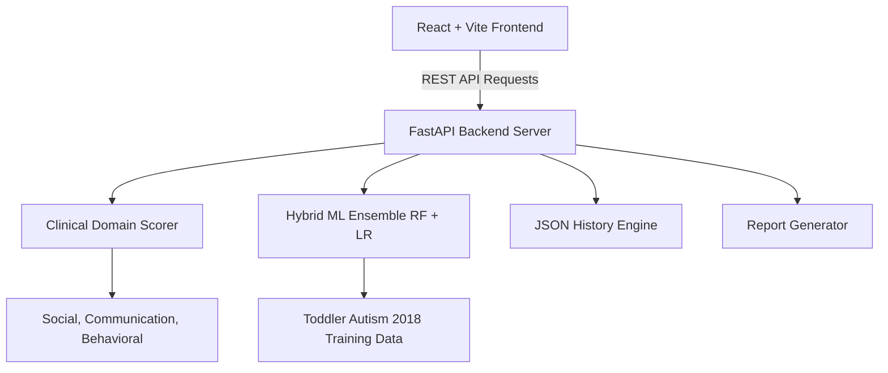

# Architecture Overview: TinyTots ASD Screening v2

## Core Subsystems
1. **Frontend Client**: SPA designed with React 18, Tailwind CSS, Lucide icons, and Radix UI components. Handles multi-step form progression and chart visualizations.
2. **REST API**: FastAPI async server providing validated schemas via Pydantic v2.
3. **Clinical Domain Scorer**: Age-aware scoring module categorizing risk into Social, Communication, and Behavioral domains.
4. **Machine Learning Predictor**: Ensemble of Random Forest and Logistic Regression models trained on balanced clinical datasets.
5. **Storage Module**: File-based persistent storage for longitudinal tracking and trend detection.
